# **1. 引言：**

AI > ML > NN > DL

TensorFlow：Google 出品的机器学习框架

Keras：构建在 TensorFlow 之上的高层接口

PyTorch：Facebook 出品的机器学习框架，可以在 GPU 上运行张量

Scikit-learn：易上手，用于分类、回归等

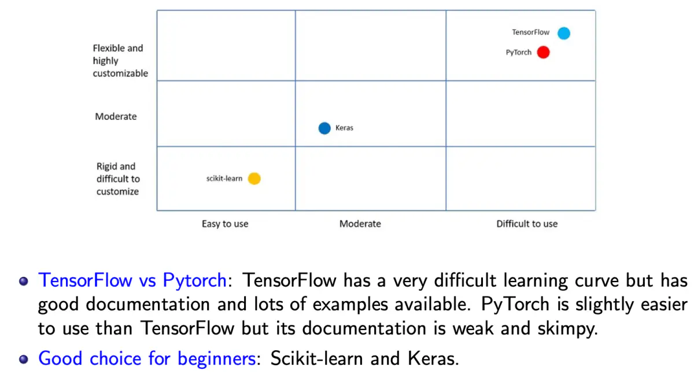
# **2. Python（3.11.13）：**

type(<object>) 例如：

print(type((1,2,3)) #<class 'tuple'>

new_list = [expression for element in old_list if condition] 例如：

even_squares = [x*x for x in nums if x % 2 == 0]

可以写两个 for，if 可选，例如：

pairs = [(x, y) for x in [1,2] for y in [3,4]]

new_dict = {key_expression : value_expression for element in iterable if condition} 例如：

filtered = {k: v for k, v in old_dict.items() if v > 10}

new_set = {expression for element in iterable if condition}（和列表推导式一样，但会去重）例如：

s = {x*x for x in [1, 2, 2, 3]} # {1,4,9}

元组可以作为字典的键和集合的元素，列表不行

元组不可修改

容器（container）：可以用 "in"

可迭代对象（iterable）：可以用 for 遍历。所有容器都可迭代，其他还有：生成器（带 yield）和文件

zip 的参数必须是可迭代对象，长度以最短的为准（返回的是迭代器）

```python
a = [1, 2, 3]
b = ["x", "y"]
zip(a,b) #(1,"x"),(2,"y") 是一个迭代器
```
*months：把参数打包成元组（* 在函数调用时是解包，在参数列表中是打包；** 对应字典）例如：
def print_months(*months):

    print("The last month is " + months[-1])

print_months("January", "Febuary", ..., "December")

类（class）：方法的第一个参数必须是 self，但调用时不用传。写在 __init__ 外面的是静态变量，写在 __init__ 里面的是实例变量（成员），默认都是 public。例如：

```python
class Cat:
  species = "Feline"   # 静态变量，用 Cat.species 访问
  def __init__(self, name):
      self.name = name  # 成员
      self._n = 1 # protected，实际上仍然可以修改
      self.__m = 1 # private，实际上是把名字改成了 _Cat__m
      # 如果你想修改 __m，其实只是新定义了一个 __m，_Cat__m 并没有变
      # 如果直接访问 __m，会报错！因为没有定义
  def f(self):
      print("m")
c = Cat()
c.f() # 不用传 self！

class sCat(Cat): # 继承
  def __init__(self,name,m)
    super().__init__(name)
    self.__m = m
```
模块（module）：一个可以被 import 的 Python 文件
包（package）：许多模块的集合，必须包含 __init__.py

mypackage/

    __init__.py

    math_utils.py

    string_utils.py

库（library）：许多包的集合，例如 numpy、pandas

```python
from [module] import [function/class/variable]
from [package].[module] import [function/class/variable]

import math
print(math.sqrt(16))

from math import *
print(sqrt(16)) # 不需要写 "math."

from math import sqrt
print(sqrt(16)) # 不需要写 "math."

import sklearn.cluster.KMeans # 调用时要写很长
from sklearn.cluster import KMeans # 直接写 KMeans() 即可

from google.colab import drive
import pandas as pd
drive.mount('/content/drive')
df = pd.read_csv('/content/drive/My Drive/pokemons.csv', index_col=False) # index_col 设为 False 时，现有的列（如 Name、Score、Remark）都不会被用作索引，而是在最左边新增一列 0、1、2…… 作为索引，就像 Excel 最左侧的行号。
print(df)
output = pd.DataFrame({'CustomerId': np.array([1, 2, 3]), 'CanRepayLoan': np.array([0, 0, 1])})
output.to_csv('/content/drive/My Drive/loans.csv', index=False)
```
**NumPy：**
```python
import numpy as np
a = np.zeros((2,2)) # float，必须写两层括号！！！！！！！！
a = np.ones((2,2)) # float
a = np.full((2,2),7)
a = np.eye((2,2)) # 单位矩阵，生成 float！即 [[1.,0.],[0.,1.]]
a = np.random.random((2,2,2))
```
是 a.shape 而不是 a.shape()；一维数组的 shape 返回 (3,)
如果要把元组拆开传参，调用函数时可以写 *a.shape

是 a.ndim 而不是 a.ndim()

A.size 是元素个数

A.itemsize 是每个元素的字节数

总字节数 = A.size * A.itemsize

a = [1,2,3]

a[i]：i >= 3 时报错！

a[-i]：i >= 4 时报错！

a[i:j:n]：步长为正时，默认 i := 0，j := len(a)（若 i >= j 则为空）

   步长为负时，默认 i := len(a)-1，j := -1（若 i <= j 则为空）

i 或 j 超出范围时，会被截断到默认值

简单切片返回的是视图（view，即引用）：不用列表或 np.array 作索引，只用 :

fancy 索引返回的是副本（copy）：用列表作索引（用 np.array 作索引同样是副本）

布尔索引也是副本：

```python
a = np.array([[1,2],[3,4]])
b = a%2==0
print(b)
'''[[False  True]
 [False  True]]'''
print(a[b]) # [2,4]
print(a[a%2==0]) # [2,4]
# 重要！！！！下面这两个：
a[1,0] # 3，等同于 a[(1,0)]
a[[1,0]] # [[3,4],[1,2]]

a.dtype # int64
type(a) # <class 'numpy.darray'>
b = np.array(a,dtype=np.float64)
c = a+b # c=np.add(a,b)，另有 subtract multiply divide sqrt(x)

np.dot(a,b)
a.dot(b)
a@b
np.matmul(a,b)

np.append(a,b,axis)
# 若沿 axis=0 追加，其他轴（1、2）的形状必须相同
# 若沿 axis=1 追加，其他轴（0、2）的形状必须相同

np.sum(a) #10
np.sum(a,axis=0) # [4,6]
np.sum(a,axis=1) # [3,7]
# 另有 min,max,mean,std,np.median(a),np.log(a),np.abs(a)
# 另有 argmax argmin argsort np.linalg.int(a)
# argsort 输出第 i 小元素的下标，例如 [0 2 1 3]，默认沿最后一个轴
a.T # 对一维数组没有作用
np.transpose(a) # 视图！
a.transpose([1,0])

a.reshape(4,1) # 视图！！

# None = np.newaxis
np.expand_dims(a,axis=0) # 视图！
d = np.ones((2,3,4))
d[None].shape # (1,2,3,4)
d[:,None].shape # (2,1,3,4)
d[:,:,None].shape # (2,3,1,4)
d[None,:].shape # (1,2,3,4)
d[None,:,:].shape # (1,2,3,4)

# tile 是把整个数组复制若干份，repeat 是把每个元素重复若干次
# np.repeat(a, repeats, axis=None) 默认先拍平成一维
# tile 是副本，不是视图！
np.tile(d,(5,6)) # (2,3*5,4*6)
np.tile(d,(2,1,5,6)) # (2,2*1,3*5,4*6)

a = np.array([[1,2,3,4],[5,6,7,8],[9,10,11,12]])
a[  [[0,0],[1,1],[2,2]] , [[0,1],[1,2],[2,3]]  ] # 最佳写法
a[ [[i,i] for i in range(3)] , [[i,i+1] for i in range(3)] ]
[a[0,0:2],a[1,1:3],a[2,2:4]] # 不对！这是 list，不是数组
np.array([a[0,0:2],a[1,1:3],a[2,2:4]])
# 结果都是：[[1,2],[6,7],[11,12]]
```
广播（Broadcast）：
先在左边补 1，再逐维检查：必须相等，或者至少一方为 1 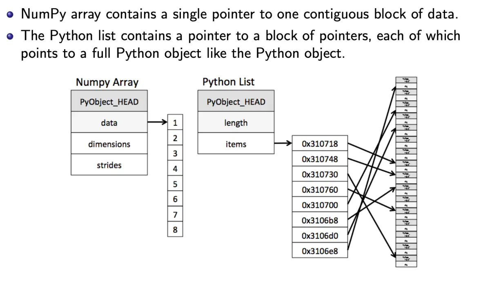

NumPy ≈ C++，只用一个指针；而 Python 列表要用大量引用


# **3. 贝叶斯：**

机器学习是让计算机在没有被显式编程的情况下也能行动的科学与工程。

监督学习：

训练集：输入 + 正确输出（标签），因此需要领域专家来标注数据

学习两者之间的关系

训练时间较短，准确率高

例如：分类、回归

无监督学习：

训练集：只有输入

寻找数据中的模式

训练时间较长，准确率较低

例如：聚类、关联

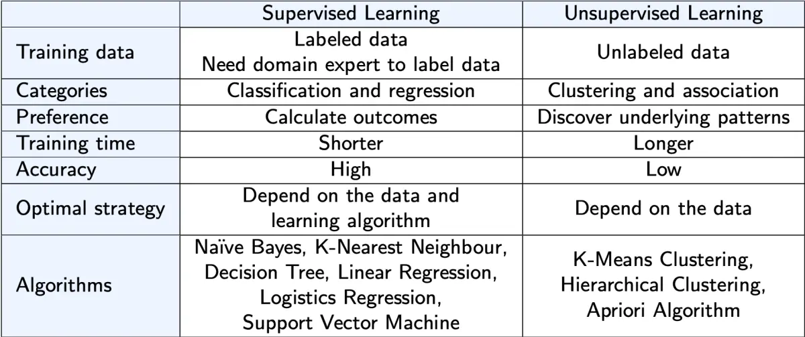
朴素贝叶斯：

P(B|E) = P(B) × P(E|B) / P(E)

E：证据（特征），B：信念（类别）

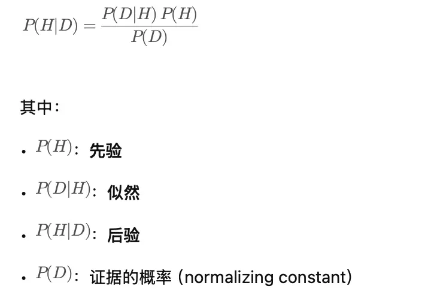
「朴素」的前提：

1. 证据之间条件独立：P(e1e2|B)=P(e1|B)*P(e2|B)

2. 各证据贡献相同：在 P(B|e1e2)=kP(B)(P(e1|B)^w1)*(P(e2|B)^w2) 中 w1=w2=1

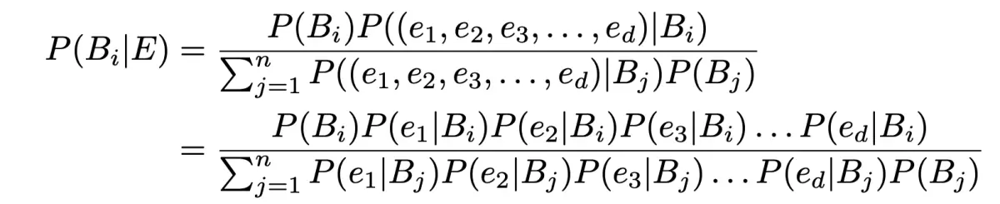
去掉分母：

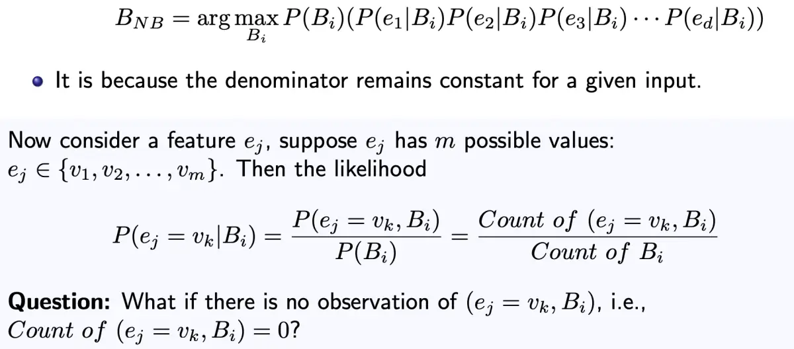
α 拉普拉斯平滑：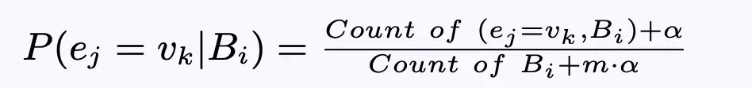

m = ej 的取值种类数，这样所有概率之和才为 1

连续变量：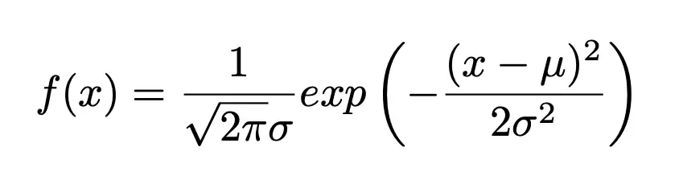

对每个类别 B 计算均值和标准差，再代入 f(x)

为避免浮点数溢出，可以改用对数求和

优缺点：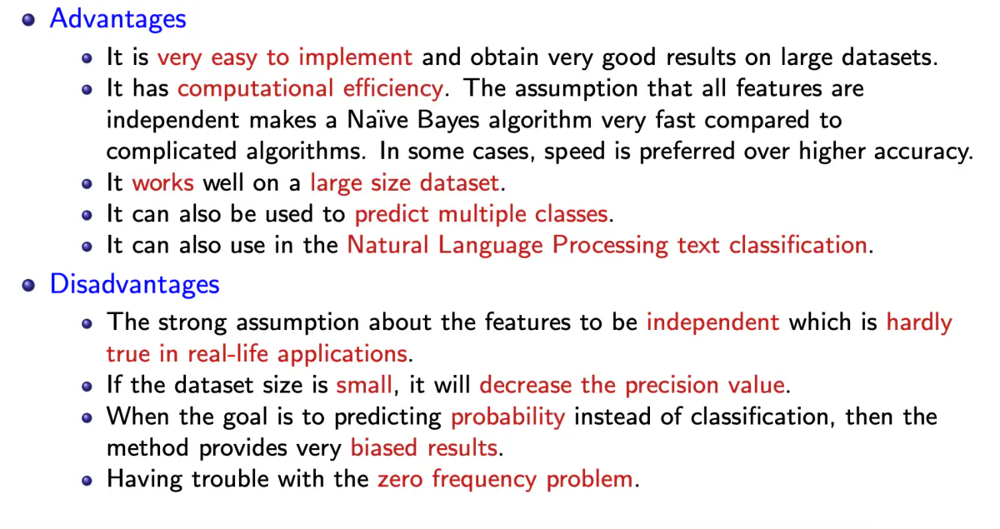

# 4. KNN：

惰性学习（Lazy Learning）：训练时不建模，只在测试时才计算

非参数（Non-Parametric）：

1. 没有参数（指从数据中学到的参数；人为设定的叫超参数，例如 KNN 中的 K）

2. 不做任何假设（例如分布假设）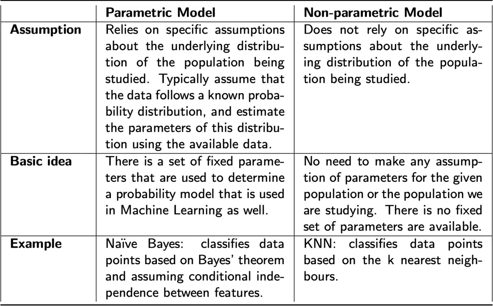

步骤：

1. 准备训练数据和测试数据。

2. 选定 K 值。

3. 确定使用哪种距离函数。

4. 计算新数据到 n 个训练样本的距离。

5. 对距离排序，取最近的 K 个样本。

6. 按这 K 个最近邻的多数投票决定测试样本的类别。

标准化：

Xnew = (X - mean) / sd

距离函数：

欧氏距离

曼哈顿距离：在高维时效果好

余弦距离：1-cos(θ)，范围 0（相似）~ 2（不同）

汉明距离：不同位的个数，用于 one-hot

K 越大，对离群点越稳健

打破平票的方法：

K 减 1

给更近的点更大的权重

K 不能太大也不能太小，取 sqrt(N) 较好

交叉验证：

1. 把训练数据分成 d 组（fold），每组大小大致相同。

2. 留出第一组，称为验证集。

3. 用剩余数据训练分类器。

4. 对每个 K 值，用训练集中的 K 个最近邻对验证集的每个数据分类，记录错误率。

5. 对验证集的全部 d 种选法重复第 2–4 步。

6. 对每个 K，求各验证集上的平均错误率，选错误率最低的 K。


模型评估：

混淆矩阵：TP、TN、FP（预测为正）、FN（预测为负）

Accuracy = (TP+TN)/总数，Error = (FP+FN)/总数

Precision = TP/(TP+FP)，Recall = TP/(TP+FN)（召回率）

F1-score = 2*P*R/(P+R) = 2TP/(2TP+FP+FN)

Micro F1：用总的 TP、FP、FN 计算

Macro F1：各类 F1 的简单平均

Weighted F1：按各类样本数加权平均

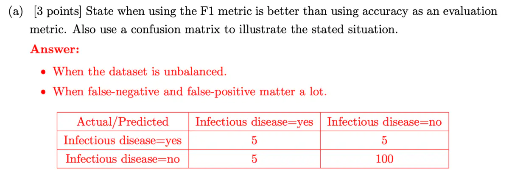
F1 比 Accuracy 好，但也只关注正类（如果全部预测为正类 = 100%，就失效了）

MCC = (TN*TP-FN*FP) / sqrt((TP+FP)*(TP+FN)*(TN+FP)*(TN+FN))

MCC 是最好的指标，例如：Accuracy = 0.913，F1 = 0.5（正负类互换后为 0.95），MCC = 0.45

MCC 的范围：-1（完全相反）~ 0（随机）~ 1（完美）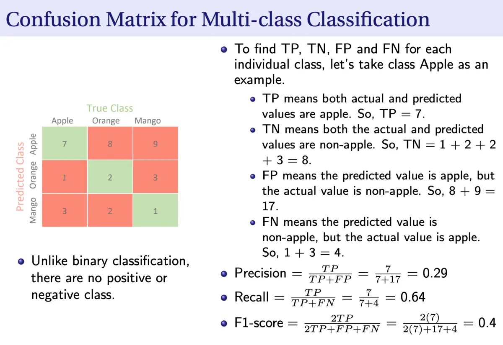


误差度量：

平均绝对误差（MAE）：sum(abs(ai-pi))/m

均方误差（MSE）：sum((ai-pi)^2)/m

平均绝对百分比误差（MAPE）：sum(abs((ai-pi)/ai))/m

优缺点：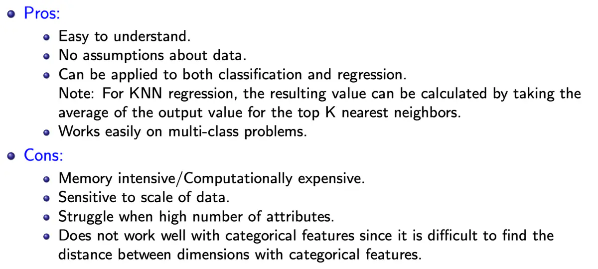

KNN 加速

降低训练数据的维度（例如用主成分分析 PCA）。

用合适的数据结构存储数据，例如 KD 树：把整个空间切分开，只需计算一部分距离

并行计算距离。


# 5. KMeans：

步骤：

0. 标准化！！！！

1. 随机选 K 个数据点（种子）作为初始质心（簇中心）。

2. 计算训练集中每个数据点到 K 个质心的距离。

3. 按距离把每个数据点分到最近的质心。

4. 根据当前的簇成员重新计算质心。

5. 若未满足收敛条件，重复第 2–4 步。

停止条件：

没有（或极少）数据点被重新分到其他簇

质心没有（或极少）变化

相邻两次迭代之间误差平方和（SSE）的下降量很小

SSE = sum(dist(pi,cj))

高质量的聚类：

最大化簇间距离（隔离度），即不同簇之间的距离

最小化簇内距离（紧凑度），即同一簇内数据点之间的距离

如何处理离群点？

在聚类过程中**删除一些数据点**：它们离质心的距离远大于其他点。

保险起见，可以先观察这些可能的离群点几轮迭代，再决定是否删除。

进行**随机抽样**。抽样只选一小部分数据点，选中离群点的概率很小。

其余数据点再按距离或相似度比较、或用分类的方法分到各簇中。


优缺点：

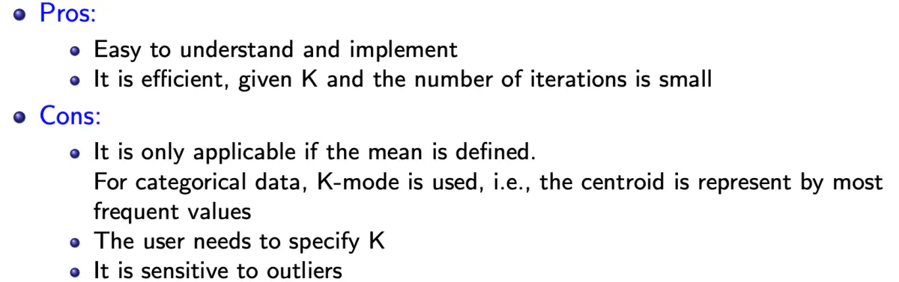
其他缺点：

对初始种子敏感

不适合发现非超椭球（或超球）形状的簇，例如月牙形、线形


PCA：

把数据投影到正交的特征子空间上。

PCA 的主要思想是：对一个由许多相互关联的变量组成的数据集降维，同时尽可能多地保留数据集中的变化（方差）


# 6. 人工神经网络（ANN）：

Sigmoid / Logistic 激活函数：f(x) = 1/(1+e^-x)

二值阶跃激活函数：x<0 时 f(x) = 0，x>=0 时为 1（使用它的神经元称为感知机 / 阈值逻辑单元）

wi = wi+η(T-O)xi

θ = θ+η(T-O)

停止规则：

**设定最长训练时间**：为了完成当前这一轮，训练可能会稍微超出设定的时间。

**设定允许的最大训练轮数**：超过最大轮数就停止训练。

**设定最低准确率**：一直训练直到达到指定的准确率


**学习**是更新感知机权重的过程。我们一开始把权重 w1 设为 0.1、w2 设为 0.5，但会产生一些错误；之后把权重更新为 0.5，所有样本都预测正确。整个过程用了 4 轮（epoch）。

**Epoch** 指完整地遍历一次训练集。


在二分类问题中，**决策边界**或**决策曲面**是把向量空间分成两部分（每个类别一部分）的超曲面。分类器把决策边界一侧的点都归为一类，另一侧的点归为另一类。


# 7. 多层感知机（MLP）：

多层感知机（MLP）是一种前馈神经网络（前馈是指网络中的节点不构成环）。

**如何初始化权重和偏置？**

初始化为较小的随机值。（如果全为 0，所有神经元的更新会完全相同）

**如何训练？**

1. 让网络根据给定输入计算输出（前向传播）

2. 计算误差 / 损失函数（即计算输出与目标输出之间的差距）

3. 更新隐藏层与输出层之间的权重和偏置（反向传播）

4. 更新输入层与隐藏层之间的权重和偏置（反向传播）

5. 回到第 1 步

**何时停止训练？**

循环固定次数之后。

训练误差降到某个阈值以下时。

在验证集误差达到最小时停止（防止过拟合）。

**损失函数：**

损失函数的用途：

1. 在训练中求导以更新参数

2. 在训练中监控每个 epoch，判断是否收敛

3. 量化模型预测的准确程度

神经网络唯一的目标就是优化（最小化）损失函数。

"categorical crossentropy"（CCE）：标签必须是 one-hot

"sparse categorical crossentropy"（SCCE）：标签必须是整数

"mean squared error"（即 "MSE"）、

"mean absolute error"（即 "MAE"）：这两个用于回归

**优化算法：**

它决定训练中参数具体如何调整。

例如梯度下降。

**如何更新权重和偏置？**

假设激活函数是 sigmoid：σ(x) = 1/(1+e^−x)，误差 / 损失函数为 E = sum((Ok-Tk)^2)/2

更新权重和偏置的公式，是用梯度下降最小化损失函数推导出来的。

前向：Oi(input)--wij,θj-->f(Oi)->σ(f(Oi))=Oj--wjk,θk-->f(Oj)->f(σ(f(Oj))=Ok->E

偏导：-----------Oi------δj ---Oj(1-Oj)--------Oj-----δk-----Ok(1-Ok)--(Ok-Tk)

推广：------------------Oi------δj----σ'(Oj/Oi)-------Oj-----δk-----σ'(Ok/Oj)--E'(Ok)


总体思路：α1 = α0 - η▽E(α)  △α = -η▽E(α)

δE/δOj = sum(δk*wjk)

δk = Ok(1-Ok)*(Ok-Tk)               一般形式：δk = σ'(Ok/Oj) *E'(Ok)

δj = Oj(1-Oj)*sum(δk*wjk)           一般形式：δj = σ'(Oj/Oi)*sum(δk*wjk)

△wjk = -ηδkOj

△θk = -ηδk

△wij = -ηδjOi

△θk = -ηδj


为什么用梯度下降，而不是直接求闭式数学解？

大多数非线性回归问题没有闭式解。

即使有闭式解，用梯度下降求解的计算代价也更低（更快）。


步骤：

1. 导入所需的库，定义全局变量

2. 加载数据：keras.datasets.load_data() 或 np.load()

3. 探索数据：plt.show()

4. 构建模型：搭建全连接层，通常用 ReLU，最后一层用 softmax

5. 编译模型（训练方式）：损失函数、优化器、评估指标

6. 训练模型：model.fit()

7. 评估模型准确率：model.evaluate()

8. 保存模型：model.save()

9. 使用模型：model.predict()

10. 绘制混淆矩阵


ReLU：f(x) = max(0,x)

可求导，支持反向传播，同时计算效率高。

只有当线性变换的输出小于 0 时，神经元才会被关闭。

由于其线性特性，能加快梯度下降的收敛（梯度不会消失 == 收敛更快）


ReLU 死亡问题（Dying ReLU）：

图像的负半轴使梯度为零

反向传播时，部分神经元的权重和偏置得不到更新（δ0/δw = 0）

出现永远不会被激活的「死神经元」

所有负输入立刻变成零，降低了模型正确拟合、从数据中学习的能力


Softmax(zi) = e^zi/sum(e^zj)

L2 正则化：把所有参数往 0 拉，避免参数过大，从而防止过拟合

防止模型记住噪声

噪声：大量影响泛化的小离群点（并不算真正的离群点）


分类 / 多分类交叉熵损失：CCE = -sum(yi*log(pi))，y 为真实的 one-hot 标签


#### MLP 分析：

**问题：梯度消失与梯度爆炸**

训练神经网络（尤其是隐藏层很多时）的一个问题是梯度消失和梯度爆炸。

训练时，梯度（斜率）可能变得很大，或很小乃至指数级地小，导致训练困难。

结果是权重不再更新，学习停滞


**如何判断模型是否出现梯度消失 / 爆炸？**

梯度消失（通常是 sigmoid 和 tanh 的导数太小）：

高层参数变化剧烈，而低层参数几乎不变（甚至完全不变）

训练过程中，模型权重可能变为零。

模型学得很慢，几轮之后训练可能停滞。

梯度爆炸（通常是 w 太大）：

模型参数呈指数增长

训练过程中，模型权重可能变成 NaN

模型经历「雪崩式」的学习过程。


**需要多少层？每层多少个神经元？**

输入层

层数 = 1

神经元数 = 数据的特征数（即列数）（例如 XOR 的输入层有 2 个神经元）

输出层

层数 = 1

神经元数 = 大多为 1，除非使用 softmax（就像手写数字识别的例子）


隐藏层

层数

如果数据线性可分，完全不需要隐藏层

如果数据不太复杂、维度或特征较少，1–2 个隐藏层即可

如果数据维度或特征很多，可以用 3–5 个隐藏层来求得较优解


神经元数

隐藏层神经元数应介于输入层和输出层的大小之间

最合适的隐藏神经元数为 sqrt(输入层节点数 × 输出层节点数)

后续层的隐藏神经元数应逐层递减，以逐步提取模式和特征、识别目标类别。


权重控制陡峭程度，偏置控制平移


神经网络的隐藏层通常使用可微的非线性激活函数，这样模型才能学习更复杂的函数。

隐藏层最常用的三种激活函数：

线性整流（ReLU）：

效果好，不容易出现梯度消失

1. 把输入缩放到 0–1

2. 使用 He 权重初始化

这样净输入能落在正负交界附近

n_in = 输入个数

He Normal ~ N(0,2/n_in)        He Uniform~U[-sqrt(6/n_in),sqrt(6/n_in)]

这样大部分净输入落在 [-1,1]

避免：梯度忽正忽负，以及神经元死亡

Logistic（Sigmoid）：

局限：输出恒 > 0，所以所有 w 总是朝同一方向变化

1. 把输入缩放到 0–1

2. 使用 Glorot 权重初始化

n_io = 输入与输出的个数

Glorot Normal ~ N(0,2/n_io)        Glorot Uniform~U[-sqrt(6/n_io),sqrt(6/n_io)]

这样大部分净输入落在 [-1,1]

避免：梯度忽正忽负，以及净输入偏移导致饱和

双曲正切（Tanh）：(e^x-e^-x)/(e^x+e^-x)，范围 [-1,1]

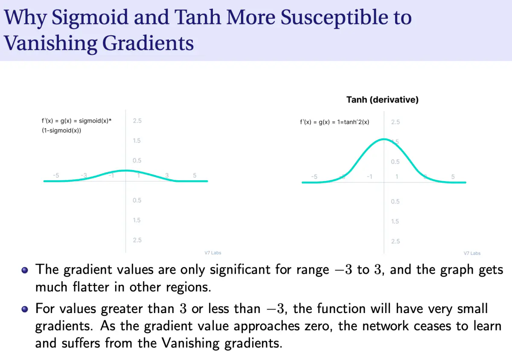
RNN：sigmoid/tanh  MLP/CNN：ReLU

输出层：linear / sigmoid / softmax

回归：linear

分类：

二分类：sigmoid

多分类：softmax，每个类别一个节点

多标签：sigmoid，每个类别一个节点（一个样本可以同时属于多个类别）

# 8. 图像处理：

(x,y)：x 从左到右，y 从上到下，从 (0,0) 开始

灰度图：0（黑）~ 255（白），每像素 8 bit

彩色图：红、绿、蓝，每像素 3*8 bit

v = 0.299R+0.587G+0.114B


卷积要用翻转后的卷积核！！


数据增强：对原始数据做变换，以得到更多数据并避免过拟合


仿射变换：

保持：共线性、平行性和距离比例

例如：平移、旋转、缩放、错切 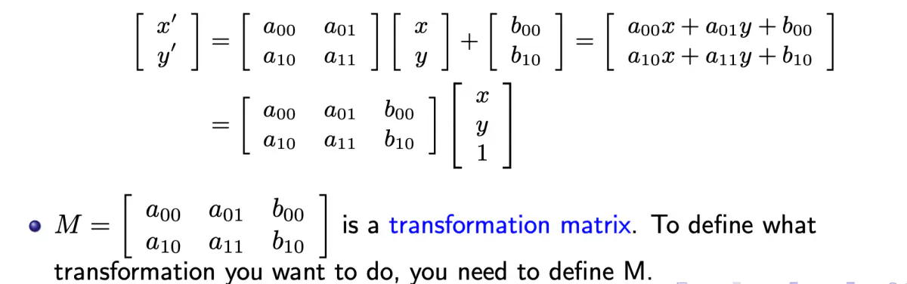

平移：[[1 0 t1] [0 1 t2]]

反射：

上下翻转：[[1 0 0] [0 -1 height-1]]

左右翻转：[[-1 0 width] [0 1 0]]

旋转（顺时针）：[[cosθ sinθ -x0cosθ-y0sinθ+x0] [-sinθ cosθ x0sinθ-y0cosθ+y0]]

缩放 / 调整大小：把输入图像调整为相同尺寸


**图像操作的特点：**

按作用区域分：

点操作：某坐标的输出值只取决于同一坐标的输入值

对比度拉伸：I = (I-Imin)/(Imax-Imin)*255

灰度阈值：若 I<T 则 =0，否则 =255

如何自动确定 T？大津法（Otsu）：用 T 把像素分成两组，令 Tnew = (mean1+mean2)/2，重复直到 mean1、mean2 稳定

局部操作：某坐标的输出值取决于该坐标邻域内的输入值（通常是 4 邻域或 8 邻域）

图像平滑：**去除噪声**，并**柔化图像的边缘和角点**，也叫模糊（使用均值 / 高斯核）

图像边缘检测：检测物体或图像中区域的边界（边缘）（核中有正有负）

图像锐化：**去除模糊**、**增强细节**并去雾（中心 9，其余 -1）

全局操作：某坐标的输出值取决于输入图像的所有值


卷积：

边界处理：

忽略

补零（最常用！！！！！！！！）

复制边界

反射边界（以边界外侧为镜面）：

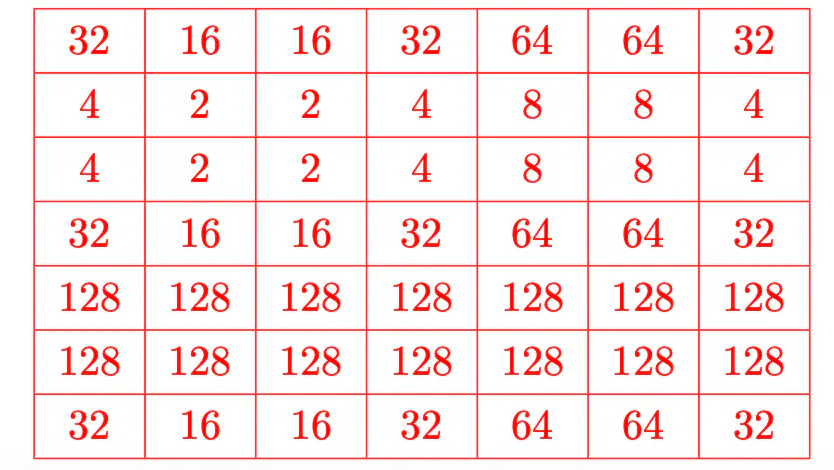
镜像边界（以边界本身为镜面）

均值：全部 1/9

锐化：中心 9，其余 -1

边缘：

水平边缘（上下变化）：

Sy = [

  [  1,  2,  1],

  [  0,  0,  0],

  [ -1, -2, -1]

]


垂直边缘（左右变化）：

Sx = [

  [ 1,  0, -1],

  [ 2,  0, -2],

  [ 1,  0, -1]

]

 

拉普拉斯：

Sxy = [

  [ 0,  1, 0],

  [ 1,  -4, 1],

  [ 0,  1, 0]

]

边缘强度 = |▽(Gx,Gy)|，带方向，远比拉普拉斯好

拉普拉斯实际上是 ▽^2(Gx,Gy)，对噪声高度敏感且没有方向


# 9. CNN：

构建 CNN 的三类主要层：

输入层：

单通道 2D 图像（灰度）

3 通道 2D 图像（RGB）

3D（流体、视频、某结构的多层切片）

卷积层：

如果有 2 个输入通道，那么每个卷积核的大小是 n*n*2（深度相同）；卷积核的个数就是输出通道数

池化层：合并卷积后图像中的像素区域

通常是最大池化（取最大值）或平均池化（取均值）

全连接层：MLP

输出层：softmax


mask = (rand >= p) / (1 - p) ***可以保持均值不变！！


注意 kernel 数量不相加，是分开的，等于 bias 数！channel 是相加的，channel 数量不是 bias 数量


步长（Stride）：每次移动的距离，默认 (1,1)

为什么要把步长设大一些？

重叠更少，因此输出体积更小，输出需要的内存更少

由于特征图更小，可以避免过拟合，尤其是属性很多的图像处理任务

输出尺寸 = (图像尺寸 - 卷积核尺寸) / 步长 + 1

补零：补 (K-1)/2，则尺寸 = (图像尺寸 - 1) / 步长 + 1


非线性

卷积是线性运算。我们需要非线性，否则两层卷积并不比一层更强大


非线性是卷积层的一部分，在神经元中完成


ReLU 在 CNN 中更受欢迎，因为它不需要昂贵的计算，并且已被证明能加快随机梯度下降的收敛。


**CNN 的整体训练流程**

1. 用随机值初始化所有卷积核和参数 / 权重

2. 前向传播，得到每个类别的输出概率

3. 计算输出层的总误差

4. 反向传播，更新所有卷积核的值 / 权重和参数，使输出误差最小

5. 对训练集中的所有图像重复第 2–4 步


**Dropout** 在神经网络中按层使用（输出层除外），通常取 0.5

迫使网络不依赖任何单个节点


**什么时候用 one-hot 编码？**

数据之间没有大小关系时

较大的数会被理解为比较小的数「更好」或「更重要」。这在有序场景中有用，但某些类别型输入本身没有排序，这会影响预测和性能

one-hot 编码让训练数据更好用、表达力更强，也便于重新缩放。


典型的 CNN 架构：

若干卷积层（通常用 ReLU 激活）

一个池化层

若干卷积层（通常用 ReLU 激活）

一个池化层

....

一个或多个全连接层（通常用 ReLU 激活）

最后一个 softmax 全连接层


一般来说，卷积层和池化层负责**特征学习**，全连接层负责**分类**

经过卷积层，特征图变得更小但更深（每层的特征图更多），深度会变得很大！！例如 32*32*3 到 5*5*16，每个通道代表某种特征

与其用一个大卷积核的卷积层（例如 9×9，81 个参数），不如**叠两层**小卷积核（例如 3×3）的卷积层，两层加起来只有 18 个参数。


# 10. Minimax 与 Alpha-Beta 剪枝

博弈的类型

完全信息 vs 不完全信息博弈

完全信息：玩家知道自己和对手所有可能的走法及其结果

不完全信息：玩家不知道对手所有可能的走法

零和 vs 非零和博弈

零和：两人博弈中，任意一步里一方的收益等于另一方的损失

非零和：两人博弈中，一方的收益不一定等于另一方的损失

确定性 vs 非确定性博弈

确定性：不涉及随机选择的博弈

非确定性：涉及某些随机选择的博弈


**Minimax** 是一种递归算法，在假设对手也采取最优策略的前提下，为玩家选择最优走法。

之所以叫 minimax，是因为它帮助我们把对手能强加给我们的（最坏）结果降到最小。


步骤：

1. 构建 n 以下的完整博弈树

2. 对每个终止状态应用效用函数

3. 选择一个尚未求值、但其所有子节点都已求值的节点：

MAX 节点（初始为 -inf）：取子节点中的最大值

MIN 节点（初始为 +inf）：取子节点中的最小值

4. 重复第 3 步，直到所有节点都已求值

5. 对节点 n 做出 minimax 决策：

n 是 MAX 节点：选择通往最高值的走法

n 是 MIN 节点：选择通往最低值的走法。


如果 MIN 不按最优策略走，**MAX 只会做得更好**


缺点：

对整棵博弈树求值可能非常耗时，尤其是围棋、国际象棋这样的游戏

搜索和评估博弈树中不必要的节点或分支，会降低引擎的整体性能和效率


解决方案：**Alpha-Beta 剪枝：**

定义两个值 α 和 β，记录某个分支对我们或对手的潜在价值

α 剪枝：因为 MAX 在别处已有更好的选择，终止该分支

β 剪枝：因为 MIN 在别处已有更好的选择，终止该分支

α 是到目前为止 MAX 沿路径找到的最好（最高）值

β 是到目前为止 MIN 沿路径找到的最好（最低）值

若 α ≥ β，即可剪掉该分支


步骤：

为了对博弈树的根节点求值，我们定义 α 和 β 两个值，分别记录当前的上界（MAX 的最好分数）和下界（MIN 的最好分数）。初始时根节点的 (α, β) = (−∞, ∞)

1. 深度优先地展开节点，直到遇到满足截断条件的节点。展开时把父节点当前的 α、β 值传给子节点

2. 对截断节点求值

3. 按 Minimax 算法更新所有已展开节点的值

4. 按以下规则更新所有已展开节点的 (α, β)：

MAX 节点：α ← max(α, 当前节点值)

MIN 节点：β ← min(β, 当前节点值)

5. 剪掉任何 α ≥ β 的节点的所有子节点

6. 回溯到一个未被剪掉的节点，回到第 1 步。如果没有这样的节点可以回溯，就返回根节点的值。

```python
def minimax_abp(board,player,alpha=-float('inf'), beta=float('inf')):
    global count
    count += 1
    result = check_game(board)
    if result != 2:
        return result 

    if player == 1:
        value = -float('inf')
        for i in range(9):
            if board[i] == 0:
                board[i] = player
                child_value = minimax_abp(board, -player, alpha, beta)
                value = max(value, child_value)
                board[i] = 0
                alpha = max(alpha, value)
                if alpha >= beta:
                    return value
        return value

    elif player == -1:
        value = float('inf')
        for i in range(9):
            if board[i] == 0:
                board[i] = player
                child_value = minimax_abp(board, -player, alpha, beta)
                value = min(value, child_value)
                board[i] = 0
                beta = min(beta, value)
                if alpha >= beta:
                    return value
        return value
```
优点：
能有效改进搜索过程

缺点：

仍然需要一直搜索到终止状态

补救方法

设置深度上限，到达上限时用**启发式评估函数**：估计局面的好坏（效用），应与实际获胜的机会相关。


**评估函数的要求：**

评估函数值的计算要**高效**

评估函数要**准确**反映获胜的机会

大多数博弈程序使用**加权线性**函数：

w1f1 + w2f2 + · · · wnfn

其中 f 是局面的特征（例如国际象棋中皇后的数量），w 是衡量对应特征重要性的权重。

例如井字棋：e(p) = MAX 仍可连成的线数 - MIN 仍可连成的线数


从过往经验中自动学习好的评估函数，是一个很有前景的新方向。


# 11. AI 伦理：

AI 系统可能造成的「伤害」

(1+3) 侵犯隐私权：**未经同意处理数据**，或以未经个人同意的方式泄露个人信息

(5) 对特定人群或群体做出**有偏见或不公平的决策**或推荐

(4) 做出**无法用通俗语言解释**的决策，因此无法判断其结论是否公正无偏

(2) 由于模型实现问题而做出**不可靠的决策**，或产出低质量结果

(7) 剥夺人们就 AI 系统对其所做决策进行**追责（accountability）**的权利


欧盟七项原则

**1 人的能动性与监督：** AI 系统应赋能于人，使人能够做出知情的决定……

**2 技术稳健性与安全：** AI 系统需要有韧性且安全。它们必须是安全的，出问题时要有后备方案……

**3 隐私与数据治理：** 除了充分尊重隐私和数据保护，还必须确保有完善的数据治理机制……

**4 透明性：** 数据、系统和 AI 商业模式都应当透明……

**5 多样性**、非歧视与公平：必须避免不公平的偏见……

**6 社会与环境福祉：** AI 系统应造福全人类……

**7 问责：** 应建立机制，确保 AI 系统的责任与问责……

人权 安全 隐私 透明 公正 福祉 责任


五项基本原则：

1(1+3) 自主：人们应能自己做决定，例如人在回路（human-in-the-loop）、隐私保护

2(6) 有益：应造福整个社会

3(2) 无害：应避免有害后果，例如系统应当稳健

4(5) 公正：多样性、非歧视与公平

5(4) 可解释：透明性与可解释性

隐私 福祉 安全 公正 透明


三个主要领域：

数据伦理：

获得客户的正当同意

处理偏见，确保人群得到公平的代表

AI 模型公平性：决策 / 推荐要公平

AI 模型监控与维护：

有些模型会自我调整以提高准确率

需要确保随着时间推移仍能正常工作


公平性的例子：

文生图：生成的人物千篇一律

对黑人被告的偏见


可能的原因：

人类偏见

招聘决策

负反馈循环

警力关注加剧偏见

样本量差异

针对少数群体的模型可能不够准确

不可靠的数据

诊断工具有限

代理指标（Proxies）：与敏感属性相关

某些少数群体的邮政编码

文化认知不足

AI 开发者和数据科学团队缺乏多样性，可能对不属于开发者群体的人产生负面影响


道德决策：

对世界的信念

赞成态度（意图）

道德知识

能够推算自身行为可能产生的后果

在这种情况下，它们可以被视为道德主体（moral agents）。
